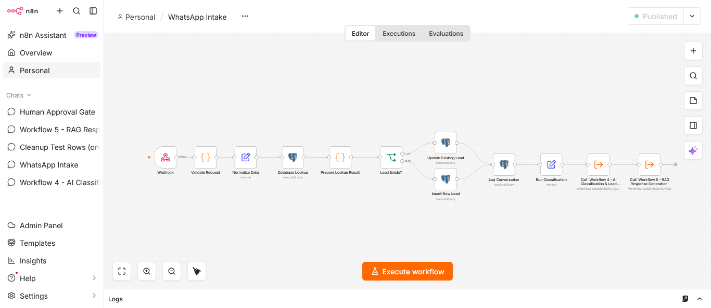
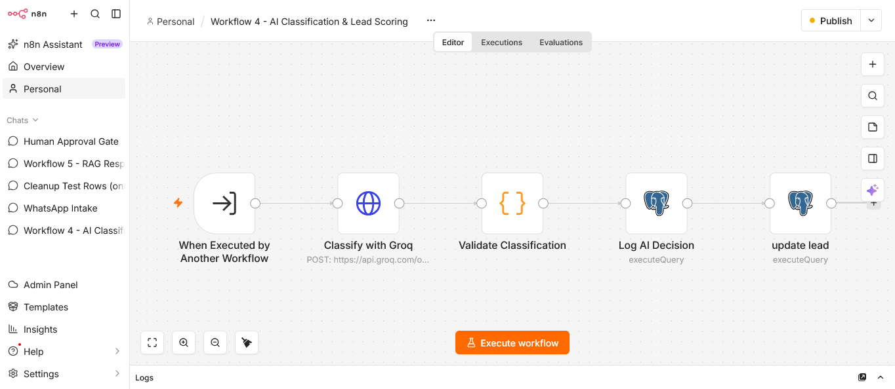
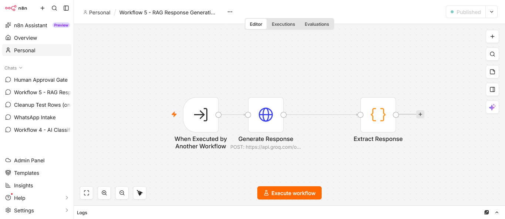
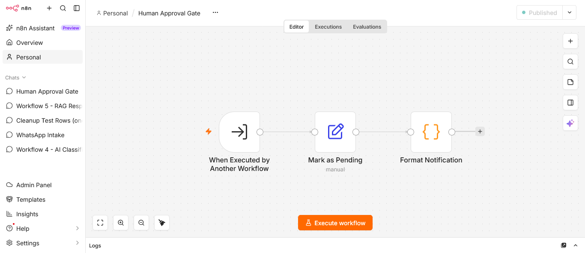
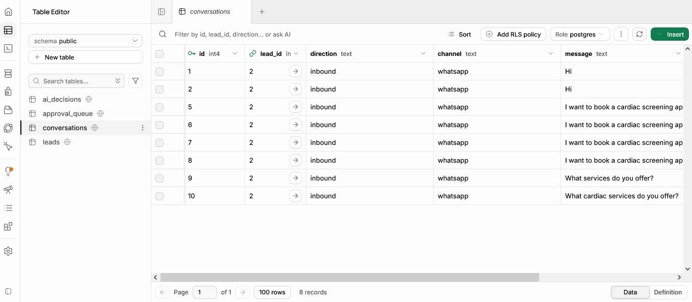
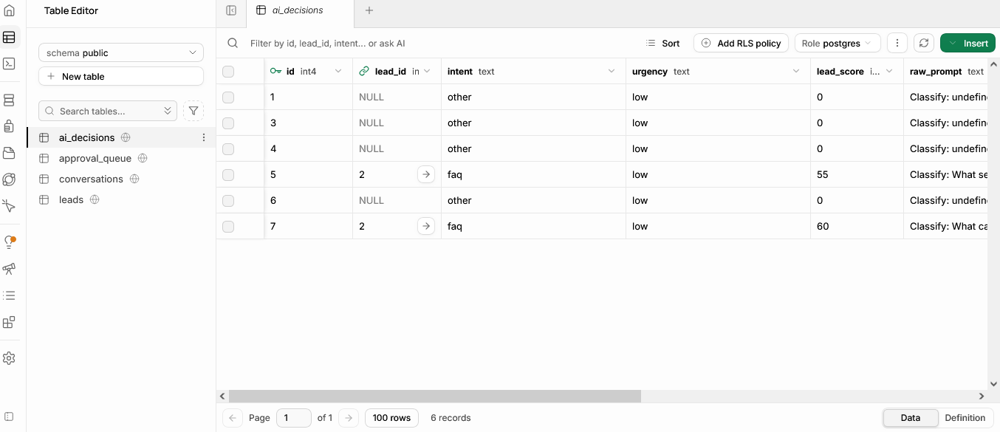

# Nexus Ops — AI Customer Operations & Lead Intelligence Platform

> One inbox for every lead. One AI that never lets one slip.

An AI-powered lead intake, classification, and response system built with n8n, Groq, and Supabase. Demo configured for **HAPS Clinic** (cardiac screening services, Lahore).

## What It Does

- **WhatsApp intake** — receives inbound messages via webhook
- **Lead deduplication** — returning contacts are matched to their existing lead record
- **Conversation logging** — every message stored with full history
- **AI classification** — Groq classifies intent, urgency, and a 0–100 lead score
- **Audit trail** — every AI decision logged with the raw prompt and response
- **Grounded responses** — AI replies using only the clinic's service information

## Architecture

```
WhatsApp Webhook
    ↓
Workflow 1: WhatsApp Intake
    Validate → Normalize → Lead lookup → Insert/Update lead → Log conversation
    ↓
Workflow 4: AI Classification & Lead Scoring (Groq)
    Classify → Validate JSON → Log AI decision → Update lead
    ↓
Workflow 5: Response Generation (Groq)
    Generate grounded reply → Extract response
```

## Screenshots

### Workflow 1 — WhatsApp Intake


### Workflow 4 — AI Classification & Lead Scoring


### Workflow 5 — Response Generation


### Workflow 6 — Human Approval Gate (roadmap)


### Supabase — Conversations


### Supabase — AI Decisions (audit trail)


## Tech Stack

| Layer | Tool |
|---|---|
| Orchestration | n8n |
| LLM | Groq (`openai/gpt-oss-120b`) |
| Database | Supabase (PostgreSQL) |
| Embeddings (offline ingestion) | Ollama `nomic-embed-text` |
| Vector DB | Pinecone |

## Database Tables

- `leads` — one row per contact (intent, urgency, lead_score, status)
- `conversations` — every message, linked to its lead
- `ai_decisions` — audit log of every classification

Full schema: [`database/schema.sql`](./database/schema.sql)

## Current Status

**Working and tested end-to-end:**
- ✅ Workflow 1: WhatsApp intake + deduplication + logging
- ✅ Workflow 4: AI classification + audit trail
- ✅ Workflow 5: Grounded response generation

**Roadmap:**
- ⏳ Risk-based routing (high lead score → human approval)
- ⏳ Workflow 6: Human approval gate (built, not yet wired in)
- ⏳ Live vector retrieval from Pinecone in the response step
- ⏳ Sending replies back via Twilio WhatsApp
- ⏳ Email and web form intake
- ⏳ Error handler workflow

## Use Cases

Clinics, real estate agencies, service businesses, and any SMB receiving customer inquiries on WhatsApp.

## Contact

**Adnan** — AI Automation & Full-Stack Developer, Lahore
- GitHub: [Dar066](https://github.com/Dar066)
- Email: YOUR_EMAIL_HERE
- LinkedIn: YOUR_LINKEDIN_URL_HERE